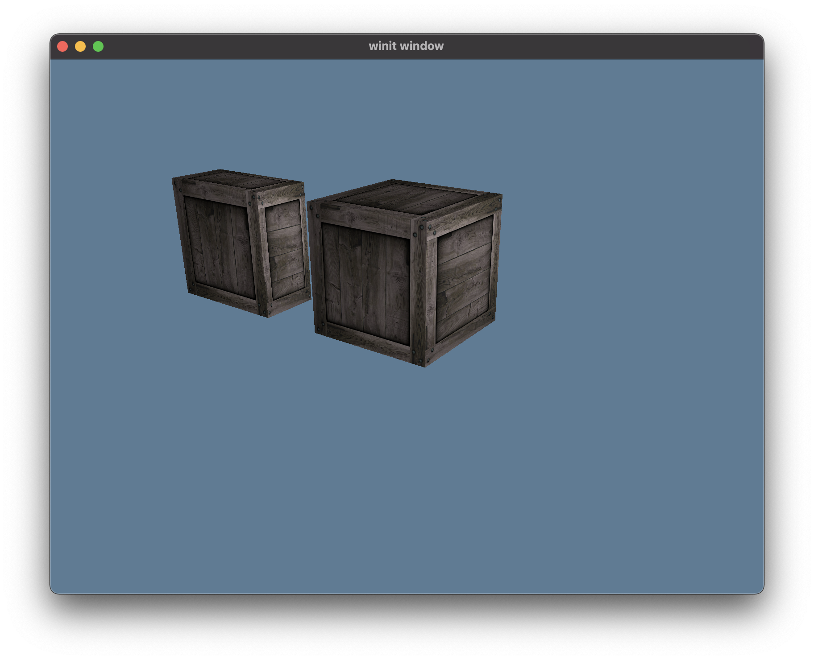

# Dotrix

3D Game Engine written in Rust (development stage)

[](LICENSE-MIT)
[](LICENSE-APACHE)
[](https://github.com/lowenware/dotrix)
[](https://discord.gg/DrzwBysNRd)

## Overview

Dotrix has a flat linear ECS (Entity Component System) in its core, designed for fast querying of
entities and their components.

1. **Entities** in Dotrix are virtual abstractions, identified by `EntityId` component containing
numerical ID. Each entitiy agregates constant number of components.
2. **Components** are regular Rust structures.
3. **Systems** are Rust functions, implementing the core logic of a game.
4. **Services** are Rust objects available through systems, providing some key
features or access to global resources, like Assets, Input or Render management.

## Getting started

The best place to start is to review examples distributed with the engine. All examples are grouped
under [examples/](examples/) folder. Later when API becomes more or less stable we will prepare a
Book for a quick start.

## Demo Example


```
cargo run --release --example demo
```

## Skeletal Animation

```
cargo run --release --example fox
```

## SkyBox

```
cargo run --release --example skybox
```

## Shaders Compilation

Dotrix is distributed with both sources and precompiled to SPIR-V shaders. So until you make a
change in a shader's code, you won't need to compile it. We are looking forward integration with
[naga](https://github.com/gfx-rs/naga), but until it is not ready, there are two possibilities of
how to deal with shaders.

### Using glslang

You can compile GLSL shaders into SPIR-V using
[glslang](https://github.com/KhronosGroup/glslang/releases/tag/master-tot). This is the way how we
compile them for releases.

### Using shaderc

You can also compile shaders at a runtime, which is very helpful during development using
optional `shaderc` feature. To make it working, you will need a recent version of `shaderc`
library which can be built using cargo or obtained as a part of the
[Vulkan SDK](https://www.lunarg.com/vulkan-sdk/).

Once you have it, don't forget to enable the feature during compilation:

```
cargo run --release --features shaderc --example demo
```
